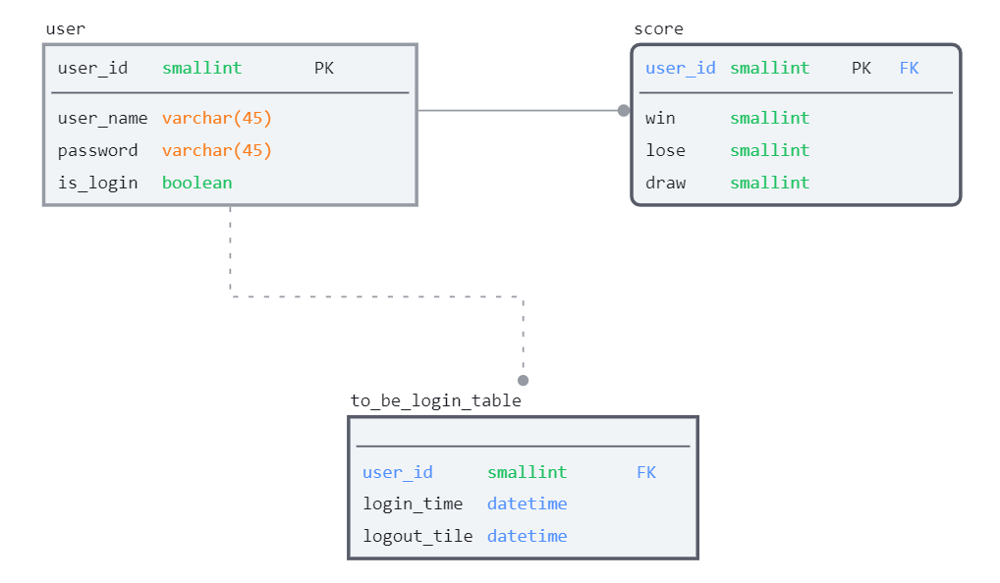

# 적당한 타이틀
- [프로젝트 리포지토리](https://github.com/soulchicken/rock-paper-scissors-game)

## 00. 팀원 소개
- [**장영광**](https://github.com/glory9802) : 가위바위보 게임 구현 
- [**박동규**](https://github.com/uyggnodkrap) : 로그인 기능 구현
- [**김동현**](https://github.com/soulchicken) : 회원가입 기능 구현
- [**황솔희**](https://github.com/solhee-hwang) : 랭킹 집계, 전체적인 소프트웨어 진행 구현

## 01. 기술 스택
- **MySQL** 8.0.29
- jdk 11.0
- JDBC
- Maven
- Lombok 1.18.20

## 02. 프로젝트 주제
**가위바위보 게임**
- 오징어게임으로 다시하면 조명받는 추억의 놀이를 랭킹 시스템으로 구현

## 03. 도메인 관련 용어
- ✌️ 가위 (scissors) : 보를 이기고 바위에게 진다.
- ✊ 바위 (rock) : 가위를 이기고 보에게 진다.
- 🖐️ 보 (paper) : 바위를 이기고 바위에게 진다.
- 🎮 게임 (game)
    1. 규칙을 정해 놓고 승부를 겨루는 놀이. 순화어는 `놀이`, `내기`.
    2. 특히, 운동 경기를 이르는 말. 순화어는 `경기`.
- 🔥경쟁 (competition)
    1. 일반적으로 '같은 목적을 달성하기 위해서 서로 겨루는 것'을 의미한다.
    2. 대개 경쟁은 '승리 혹은 우승을 위한 목표를 달성하기 위해서 여러 사람들이 치열하게 싸우는 것' 정도의 의미로 이해된다.
- 🏆 랭킹 (ranking) : 순위. 능력이나 지위에 따라 매겨지거나 정해진 순서

## 04. 기능 명세
- 프로그램 진행
    - 프로그램 시작
    - 회원가입, 로그인 선택
    - 로그인 이후 게임 시작, 랭킹 보기 선택
- 회원가입 기능
    - 아이디가 중복된 경우 다시 입력
    - 회원가입 생성시 user 테이블에 추가
    - 승무패 0,0,0으로 초기화한 상태로 score 테이블에 추가
- 로그인 기능
    - 입력한 아이디가 user 테이블에 있는 지 확인
    - 입력한 비밀번호가 해당 user의 row의 비밀번호와 일치하는 지 확인 
    - 로그인 실행
- 가위바위보 게임
    - 가위, 바위, 보 중에서 하나를 입력받음
    - 알고리즘을 통해 AI가 가위, 바위, 보를 냄
    - 승무패 확인 (score 테이블에 집계)
    - 게임 다시 시작 여부 확인
- 랭킹 집계 기능
    - score 태이블에서 다승왕을 5명 내림차순 출력

## 05. ERD (Entity Relationship Diagram)

- **user** 테이블
    - 컬럼 명
        - user_id : 아이디 번호
        - user_name : 유저 이름
        - password : 로그인 비밀번호
        - is_login : 로그인 여부를 알려줌

- score 테이블
    - 컬럼 명
        - user_id : 유저 아이디
        - win / lose / draw : 승, 패, 무승부를 기록
    - 회원가입시 승, 무, 패는 0, 0, 0 으로 시작.
    - AI와 게임시 1경기당 승,무,패 중 1개의 수가 1 증가

- login_log 테이블
    - 컬럼 명
        - user_id : 접속한 유저 아이디
        - login_time / logout_time : 로그인, 로그아웃 시간
    - 로그인 시간, 로그 아웃 시간이 기록된다.
    - 소프트웨어 내에 영향을 주지 않지만 이후 사용자들의 접속 패턴을 알기 용이하다.

## 06. 트러블 슈팅
- 

## 07. 느낀 점
- 장영광 : 
- 박동규 : 
- 황솔희 :
- 김동현 : 

## 08. 리펙토링 및 컨벤션 체크
- 추후 업데이트 예정